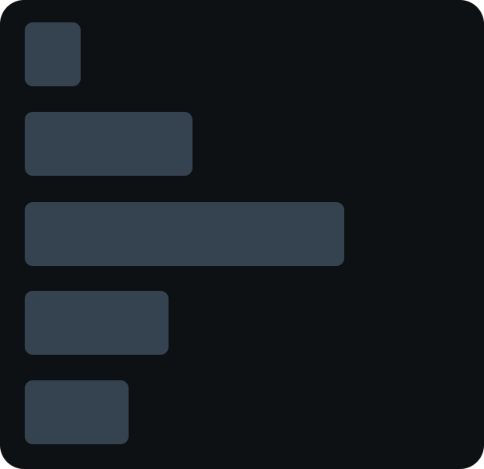

<p align="center">
  
</p>

<h1 align="center">System Overlay</h1>

<p align="center">
  A lightweight, always-on-top desktop widget that shows live CPU, RAM, and GPU stats — with smooth transparency and zero clutter.
</p>

<p align="center">
  
  
  
  
</p>

---

## Features

- **Live metrics** — CPU usage, RAM usage, GPU usage, GPU temperature, VRAM usage, updated every 500 ms
- **Smooth transparency** — panel opacity slides from 0 → 100 %; content (text + bars) always stays fully visible
- **Ghost drag area** — the overlay stays draggable and resizable even at full transparency
- **Rounded progress bars** — per-metric pastel accent colors, rendered with Pillow for crisp sub-pixel edges
- **Always on top** — floats above every other window, never steals focus
- **Right-click settings** — adjust opacity, background color, text color, and per-metric bar colors live
- **Persistent config** — all preferences saved to `config.json` and restored on next launch
- **Standalone exe** — single-file build via PyInstaller, no Python required to run

---

## Requirements

| Dependency | Purpose |
|---|---|
| Python 3.10+ | Runtime |
| [Pillow](https://pypi.org/project/Pillow/) | Image rendering |
| [psutil](https://pypi.org/project/psutil/) | CPU / RAM metrics |
| [nvidia-ml-py](https://pypi.org/project/nvidia-ml-py/) | GPU metrics (NVIDIA only) |

GPU monitoring is optional — the overlay runs fine without an NVIDIA card, it just hides the GPU rows.

---

## Getting started

```powershell
# 1. Clone
git clone https://github.com/Betadeimos/system-overlay.git
cd system-overlay

# 2. Create and activate a virtual environment
python -m venv .venv
.\.venv\Scripts\Activate.ps1

# 3. Install dependencies
pip install pillow psutil nvidia-ml-py

# 4. Run
python system_overlay.py
```

---

## Building the exe

```powershell
pip install pyinstaller
pyinstaller --onefile --windowed --icon="Icon\StatsOverlay_Icon.ico" --name="SystemOverlay" system_overlay.py
```

The output is `dist\SystemOverlay.exe` — fully self-contained, double-click to launch. Keep `config.json` in the same folder if you want settings to persist between runs.

---

## Usage

| Action | How |
|---|---|
| Move | Click and drag anywhere on the panel |
| Resize | Drag the grip dots in the bottom-right corner |
| Settings | Right-click anywhere on the overlay |
| Exit | Right-click → Exit |

The window spawns centered on screen at 224 × 224 px. Resize and reposition freely — size is remembered between sessions.

---

## Configuration

Settings are stored in `config.json` next to the executable (or script). You can edit it directly or use the right-click settings menu.

| Key | Default | Description |
|---|---|---|
| `background_color` | `#0d1117` | Panel fill color |
| `background_opacity` | `0.0` | Panel opacity (0 = fully transparent) |
| `text_color` | `#e6edf3` | Label and value color |
| `corner_radius` | `14` | Rounded corner radius in px |
| `update_interval` | `500` | Refresh rate in ms |
| `smoothing_samples` | `5` | Rolling-average window for metric smoothing |
| `show_gpu` | `true` | Show / hide GPU rows |
| `colors` | see below | Per-metric bar accent colors |

**Default bar colors**

| Metric | Color |
|---|---|
| CPU | `#93b8e8` |
| RAM | `#c4aef0` |
| GPU | `#87c498` |
| GPU Temp | `#dfc77e` |
| VRAM | `#7cc4cc` |

---

## Architecture

Everything lives in `system_overlay.py` — ~375 lines, no external UI framework.

```
GPUManager        singleton — lazy pynvml init, returns None if unavailable
MetricCollector   collects CPU/RAM/GPU, applies rolling-average smoothing
OverlayApp        owns two layered Tkinter windows, drives the render loop
```

**Two-window transparency model**

The overlay uses two windows stacked at the same geometry:

- `bg_win` (Toplevel) — renders the background panel and bar tracks. Its `-alpha` attribute drives panel opacity smoothly from 0 → 1. Held at a minimum of `0.01` so the panel shape always captures mouse events, even when visually transparent.
- `root` (Tk) — renders text, bar fills, and the resize grip at full opacity so content never fades with the panel.

Both windows use `#000001` as a color key — pixels of exactly that color are punched through (invisible + click-through) to create the rounded-corner cutout.

---

## License

MIT
