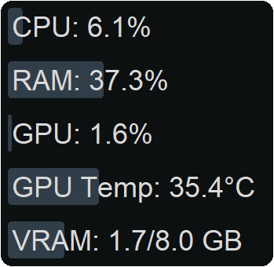

# System Overlay v2.1

 <!-- Replace with an actual screenshot if you have one -->

An always-on-top, resizable, and customizable overlay window for your desktop.

---

## Features

- **Always on Top**: Stays above all other windows.
- **Drag and Drop**: Move the overlay by holding the left mouse button.
- **Resizable**: Drag the bottom-right corner to resize the overlay.
- **Right-Click Menu**:
  - **Close**: Exit the overlay.
  - **Settings**: Open the settings window to customize the app.
- **Customizable**:
  - Change colors and opacity in the settings window.

---

## How to run the App

1. Run the App:
   ```bash
   Find and download SO.exe
   ```
2. Windows Defender:
   ```bash
   When windows stops the app from running to protect you, press more and press run anyway
   ```
---

## How to clone the repository

1. Clone the repository:
   ```bash
   git clone https://github.com/Betadeimos/system-overlay.git
   ```
2. Navigate to the project directory:
   ```bash
   cd system-overlay
   ```
3. Run the app:
   ```bash
   python system_overlay.py
   ```

---

## Usage

```plaintext
+-----------------------------------+
|         System Overlay            |
|                                   |
|  Drag me around with LMB!         |
|  Resize me from the bottom-right! |
|                                   |
|  Right-click for options:         |
|  - Close                          |
|  - Settings                       |
+-----------------------------------+
```

---

## Settings

The settings window allows you to customize the overlay:

- **Colors**: Change the background, text, and border colors.
- **Opacity**: Adjust the transparency of the overlay.

---

## Contributing

Contributions are welcome! If you'd like to improve this project, follow these steps:

1. Fork the repository.
2. Create a new branch:
   ```bash
   git checkout -b feature/your-feature-name
   ```
3. Commit your changes:
   ```bash
   git commit -m "Add your feature"
   ```
4. Push to the branch:
   ```bash
   git push origin feature/your-feature-name
   ```
5. Open a pull request.

---

## License

This project is licensed under the MIT License. See the [LICENSE](LICENSE) file for details.

---

## Credits

- Developed by [Davide](https://github.com/Betadeimos)
- ASCII art by [Davide](https://github.com/Betadeimos)